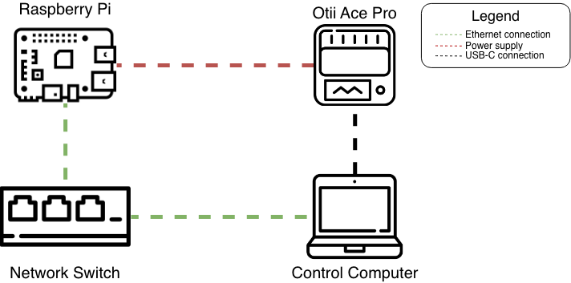

# README
## Introduction
This respository is the companion repository for the bachelor thesis:

 > *"Python Application Energy Consumption: Investigating Operating System, Python Version and Hardware Impact on the Energy Consumption of  Application Benchmarks"*.
 
  The experiment uses an Otii Ace Pro to collect Energy Consumption data from Raspberry Pi's running Pyperformance benchmarks in specific execution environments. The descriptive statistics related to each experiment run is stored in csv files which are later used to create tables, boxplots and scatterplots, such that the experiment runs can be analysed. 
The code in this repository was made using LLM's, primarily Github Copilot and ChatGPT. 
**Layout of the repository**

In the "Experiment" folder you will find install scripts for each of the available Operating Systems, named "install_python<OS>.sh", 
which are meant to setup the RPi with Pyperformance on each of the 5 CPython versions. 
You will also find the "run_benchmarks.py" script, which is meant to be executed on the controller computer, and is responsible for coordinating the experiment.
In the "Analysis" folder you will find the "analyze_data.py" script which produces figures and tables from the result files in the "results" folder. 

## Experiment overview

### Setup
#### Controller computer
Clone this repository to the controller computer.
Install the Otii 3 application, and login with an account that holds an "Automation" license.
Ensure that a Python version compatible with the "otii-tcp-client" and "paramiko" packages, is present and then install the packages.
Setup "credentials.json" with Qoitech account info and hostname for Otii server.

#### SD cards
While in theory the experiment can be conducted with a single SD card, it is more practical to have one SD card per OS, as the setup is quite time consuming. The SD cards used in the experiment are 32GB SanDisk Ultra microSD cards, which are more than sufficient for the experiment. 

##### Flashing OS Images
Flashing the OS images is currently only supported on MacOS.
Insert the SD card into the computer, and confirm the name of the SD card via "Diskutil List". 

Run the "flash_image.sh" script:
``` bash
    ./flash_image.sh <OS> <SD_ID>
```
Where <OS> is the target OS and <SD_ID>is the name of the SD card.

#### Setting up devices

The devices should be setup as shown in the figure above.
The Control Computer is connected to the RPi via ethernet through a network switch. 
The Control Computer is also connected to the Otii Ace Pro via USB C, the Otii 3 desktop application is needed make the Otii Ace Pro start applying . 
The Otii Ace provides power to the the RPi, through a modfied either micro USB cable for RPi3B or a USB-C cable for RPi4B.

Once the SD cards are flashed, they can be inserted into the RPi. 
Connect a monitor and a keyboard to the RPi and go through the OS specific "first boot" configuration. Ensure the SSH is enabled. 
Remove monitor and keyboard, once done as all interaction will happen through controller pc and peripheral will contaminate the energy measurements.
Once the RPi's are connected to the same network as the controller computer, you can ssh into them, clone the repository and run the OS specific install script, which will setup Pyperformance and its dependencies.


### Run the experiment
We can test one OS/RPi configuration per setup. 
For each run we need to update the "run_benchmarks.py" script with the OS and RPi to be tested, like so:

```python
if __name__ == '__main__':
    testrpi = "RPi4B"
    testos = "Ubuntu"
```
Found towards the bottom of the "run_benchmarks.py" script.
We also need to update the "pi_credentials.json" file with the hostname, username and password for the RPi we want to test, like so:
```json
{
    "hostname": "<IP_ADDRESS>",
    "username": "example_user",
    "password": "example_password"
}
```
Then we open the Otii 3 application, and make sure that the Otii Ace Pro is available and turned on in "power box" mode. 
Once the RPi is ready, we can execute the "run_benchmarks.py" script, which will coordinate the experiment run and save the results in the "results" folder.


### Data collection
The data is stored in csv tables in the "results" folder, where each row in the table contains the descriptive statistics related to a specific configuration. 
To generate new boxplots, scatterplots and summary table, run the "analyze_data.py" script, which will read the csv files in the "results" folder. 


## Pyperformance
The following benchmarks where used to produce the results in the thesis, and are the ones that are executed when running the "run_benchmarks.py" script.
* 2to3
* docutils 
* html5lib
* tornado_http
* async_generators
* float
* nbody
* pidigits
* regex_compile
* json_dumps
* json_loads
* pickle_list
* python_startup

### Pyperformance benchmarks eligible in the experiment
*The following benchmarks is the complete set of eligible benchmarks available via Pyperfomance*:

* 2to3
* async_generators
* async_tree_none
* async_tree_cpu_oi_mixed
* async_tree_io
* async_tree_io_tg
* async_tree_memoization
* asyncio_tcp
* asyncio_tcp_ssl
* asyncio_websockets
* chameleon
* chaos
* comprehensions
* bench_mp_pool
* bench_thread_pool
* coroutines
* coverage
* crypto_pyeas
* deepcopy
* deepcopy_reduce
* deepcopy_memo
* deltablue
* docutils
* dulwich_log
* fannkuch
* float
* create_gc_cycles
* gc_traversals
* generators
* genshi_text
* genshi_xml
* go
* hexiom
* html5lib
* json_dumps
* json_loads
* logging_format
* logging_silent
* logging_simple
* mako
* mdp
* meteor_contest
* nbody
* nqueens
* pathlib
* pickle
* pickle_dict
* pickle_list
* pickle_pure_python
* pidigits
* pprint_pformat
* pyflate
* python_startup
* python_startup_no_site
* raytrace
* regex_compile
* regex_dna
* regex_effbot
* regex_v8
* richards
* richards_super
* scimark_fft
* scimark_lu
* scimark_monte_carlo
* scimark_sor
* scimark_sparse_mat_mult
* spectral_norm
* sqlalchemy_declarative
* sqlalchemy_imperative
* sqlite_synth
* sympy_expand
* sympy_integrate
* sympy_sum
* sympy_str
* telco
* tomli_loads
* tornadoi_http
* typing_runtime_protocols
* unpack_sequence
* unpickle
* unpickle_list
* unpickle_pure_python
* xml_etree_parse
* xml_etree_iterparse
* xml_etree_generate
* xml_etree_process


